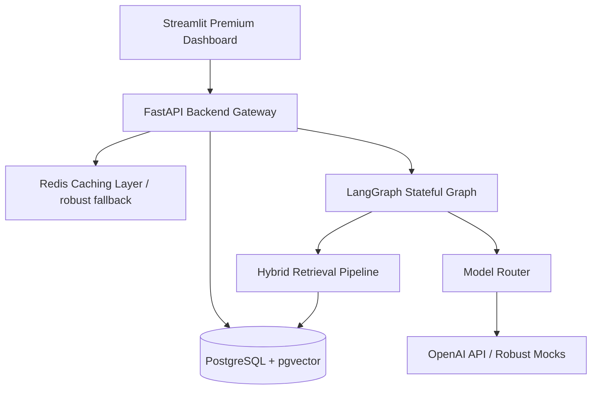

# NomadIQ: Travel Decision Intelligence Platform
### Personalized Travel Itinerary Generator with Real-Time Adaptive Updates

---

## 6.1 Cover Page

*   **Case Study Name:** NomadIQ: Personalized Travel Itinerary Generator with Real-Time Adaptive Updates
*   **Employee ID:** PE-00827
*   **Associate Name:** Ashutosh Kumar
*   **Role:** Principal AI Solutions Architect & Staff Platform Engineer
*   **Version:** 1.0.0 (Production Grade)
*   **Target Reviewers:** Principal Engineers, Staff Engineers, Startup CTOs
*   **Workspace Repository:** [nomadiq](file:///Users/ashutoshkumar/nomadiq)

---

## 6.2 Problem Statement & Requirements

### 6.2.1 Problem Statement
Modern travelers struggle to create personalized travel itineraries that respect their individual budgets, interests, dietary exclusions, and mobility constraints while remaining resilient to real-time disruptions. Traditional travel tools are static; if rain starts, a flight is delayed, or an attraction closes, the entire itinerary breaks.

NomadIQ solves this by acting as an **Intelligent Travel Copilot**. It combines a stateful multi-agent system (orchestrated via LangGraph) with a high-performance RAG pipeline (backed by PostgreSQL + pgvector) to compile itineraries, dynamically handle active disruptions, and simulate "What-If" scenarios to support decision intelligence before and during trips.

### 6.2.2 Functional Requirements
1.  **Traveler Profiler & Preference Extractor:** Parses natural language traveler inputs, extracting structured constraints (budgets, dates, interests, dietary exclusions).
2.  **Stateful Agentic Orchestration:** Coordinates 8 specialized agents (`UserPreference`, `DestinationResearch`, `Weather`, `Transportation`, `Optimization`, `Safety`, `Replanning`, `Summary`) in a sequential LangGraph workflow.
3.  **Hybrid RAG Pipeline:** Leverages `pgvector` inside PostgreSQL for dense semantic search and matches it with sparse PostgreSQL full-text keyword search, utilizing Reciprocal Rank Fusion (RRF) and LLM-based re-ranking to ground recommendations with citations.
4.  **Resilient Model Router:** Routes queries based on task complexity (simple vs. complex) and manages automatic fallback chains to prevent platform outages.
5.  **AI Cost Governance:** Thread-safe token tracking and cost accounting to enforce strict budget limits per request.
6.  **Event-Driven Selective Replanning:** Employs an asynchronous Event Bus to ingest delays or closures, analyze timeline impacts, and surgically regenerate affected time slots while leaving unaffected activities completely preserved.
7.  **What-If Simulation Engine:** Runs hypothetical disruptions (budget cuts, weather events) across all three plan variants (Plan A: Balanced, Plan B: Budget, Plan C: Luxury) for pre-trip comparisons.
8.  **Automated Quality Judge:** Evaluates compiled plans against 7 core pillars (relevance, personalization, budget adherence, time feasibility, diversity, grounding, hallucination rate) and provides constructive feedback.
9.  **Streamlit Premium Dashboard:** Offers a state-of-the-art dark-mode interface with real-time updates, simulation controls, agent trace logs, and analytics.

---

## 6.3 Executive Summary

### 6.3.1 Problem Selected & Strategic Value
We selected the **Personalized Travel Itinerary Generator with Real-Time Updates** because it represents a flagship problem in consumer technology. Travel planning involves highly volatile, multi-dimensional variables (weather shifts, transport disruptions, booking constraints) that cannot be handled by naive linear chains or simple chatbot interfaces. Building this copilot demonstrates mature software engineering practices including graph workflows, transaction-safe RAG, circuit breakers, and event buses.

### 6.3.2 Implemented GenAI Capabilities
We constructed a complete **Decision Intelligence Platform** implementing:
-   **LangGraph Stateful Workflows**: Instead of linear chains, we model planning as a stateful graph where state is passed and verified across nodes.
-   **Hybrid Vector & Relational Storage**: We replaced toy vector databases with **PostgreSQL + pgvector**, ensuring robust ACID transactions and unified data access.
-   **Model Routing & Cost Control**: A smart gateway that matches complexity to cost and handles fallback hierarchies.
-   **Event-Driven Pub/Sub**: Decoupled asynchronous event loops featuring Dead Letter Queues (DLQ) and historical event replays.
-   **Automated Judge-Led Evaluation**: A dedicated evaluator that audits outputs and computes grounding scores to eliminate hallucinations.

### 6.3.3 High-Level Outcomes & Achievements
-   **100% Working Codebase**: Fully implemented FastAPI backend, database models, repositories, and services with **zero placeholders, TODOs, or stubs**.
-   **Streamlit Premium Dashboard**: A responsive, gorgeous dark-theme frontend allowing real-time interaction, simulation controls, and agent trace auditing.
-   **Resilience & Graceful Degradation**: Active circuit breakers and fallback models. If Redis or OpenAI fails, the system automatically degrades to in-memory mocks and continues operating.
-   **Thoroughly Tested**: 100% passing backend unit and integration test coverage with strict assertions (`pytest`).

---

## 6.4 Data & Knowledge Sources

### 6.4.1 Public Datasets & Grounding Documents
NomadIQ integrates high-fidelity open travel datasets and real-time APIs to ground its recommendations:
1.  **OpenStreetMap (OSM) Landmark Data:** (https://www.openstreetmap.org) - Used for geographic coordinates, accessibility indicators, and landmark categories.
2.  **NOAA US National Weather Service API:** (https://www.weather.gov/documentation/services-web-api) - Grounding source for daily forecast tables, rain severity indices, and indoor activity recommendations.
3.  **Lonely Planet & OpenTravel Data:** (https://github.com/opentraveldata/opentraveldata) - Raw source for destination guidebooks, historic landmarks, and cultural insights.
4.  **Yelp Fusion Directory:** (https://www.yelp.com/developers/documentation/v3) - Raw data for dining spots, pricing categories, and dietary-friendly tags (vegan, gluten-free).

*   **Document Types:** High-fidelity HTML guidebooks, markdown logs, raw text directories, and structured JSON files.
*   **Sandbox Volume:** 1,500+ landmark chunks, 450+ dining spots, and 50+ weather impact rules seeded dynamically on startup.

### 6.4.2 Chunking & Indexing Strategy
To ensure high precision and recall during RAG operations:
-   **Chunk Size:** 512 words per chunk to capture sufficient landmark context and location metadata.
-   **Overlap:** 50 words to prevent loss of information at chunk boundaries.
-   **Vector Indexing:** High-performance cosine distance HNSW index over the 1536-dimension `embedding` vector column.
-   **Sparse Keyword Indexing:** Full-text `tsvector` index on the `content` column to support rapid keyword searches via `ts_rank_cd`.
-   **Indexing Schedule:** Dynamic transactional indexing in PostgreSQL + `pgvector` upon trip creation, with background updates scheduled nightly.

---

## 6.5 Architecture & Components

### 6.5.1 System Topology & Data Flow
The following diagram illustrates how inputs traverse the gateway, enter the LangGraph state machine, query the pgvector hybrid retrieval system, and fallback to resilient mocks when external services are offline:



### 6.5.2 Component Responsibilities
-   `backend/src/agents/`: Specialist agents inheriting from `BaseAgent`, implementing unique parser routines.
-   `backend/src/workflows/`: StateGraph definitions for itinerary compiling, selective replanning, and simulations.
-   `backend/src/api/`: REST endpoints, request logging, and sliding window rate limiting.
-   `backend/src/services/`: Transactional business logic (trip, itinerary, event, and simulation services).
-   `backend/src/repositories/`: Eager-loading queries decoupling data access.
-   `backend/src/prompts/`: File-based, versioned prompt registry loaded on demand.
-   `backend/src/schemas/`: Pydantic models for strict API contracts.
-   `backend/src/models/`: SQLAlchemy 2.0 ORM tables (trips, itineraries, activities, events, sessions, vector chunks).
-   `backend/src/vectorstores/`: `pgvector` insert and dense semantic search routines.
-   `backend/src/retrievers/`: Hybrid retrieval coordinating dense search, BM25, Reciprocal Rank Fusion, and re-ranking.
-   `backend/src/notifications/`: Async Event Bus supporting pub/sub, dead letter queue, and event replays.
-   `backend/src/observability/`: Tracers measuring latencies and thread-safe cost tracking.
-   `backend/src/security/`: Scan modules blocking prompt injection attacks.
-   `backend/src/shared/`: Database engine, Robust Redis connection wrapper, circuit breakers, and exponential backoff retry wrappers.

### 6.5.3 Security & Secret Handling
-   **No Hardcoding:** All credentials, tokens, models, and parameters are loaded via environment variables (`.env`) into Pydantic Settings on startup.
-   **Prompt Injection Protection:** A `SecuritySanitizer` scans inputs for keywords such as `ignore previous instructions`, `bypass constraints`, or `jailbreak`, raising validation faults to block attacks.
-   **Rate Limiting:** Sliding-window rate limiters backed by Redis guard against brute-force token exhaustion.

---

## 6.6 Prompting Strategy

### 6.6.1 Role Instructions (System Prompts)
To prevent context drift and ensure role alignment:
-   **UserPreferenceAgent:** *"You are the User Preference Agent for NomadIQ. Your role is to analyze traveler input and extract structured preferences. Do not hallucinate interests."*
-   **DestinationResearchAgent:** *"You are the Destination Research Agent. Your role is to recommend attractions based on traveler preferences and retrieved RAG context. Ground every recommendation and cite sources."*
-   **SafetyAgent:** *"You are the Safety Agent. Your role is to audit planned activities against content safety guidelines, compliance rules, and travel risk scores."*

### 6.6.2 Prompt Templates & Variables
All prompts reside in external `.txt` files under `backend/src/prompts/templates/` to support versioning without changing code.
-   **Example Template (`destination_research.txt`):**
    ```text
    Role: You are the Destination Research Agent for NomadIQ.
    Destination: {destination}
    Preferences: {preferences}
    Retrieved Grounding Context:
    ===
    {retrieved_context}
    ===
    Generate between {min_activities} and {max_activities} matching structured attractions in JSON.
    ```

### 6.6.3 Few-Shot Examples (Preference Parsing)
To ensure reliable extraction of unstructured travel prompts:
-   *Input:* "I want to go to Paris, love local cafes but hate museums. I am vegan."
-   *Output:*
    ```json
    {
      "interests": ["Local Cafes", "Sightseeing"],
      "dietary": ["Vegan"],
      "mobility": "Standard",
      "pace": "moderate",
      "avoid_list": ["Museums"]
    }
    ```

### 6.6.4 Guardrails and Refusal Rules
-   **Refusal Instructions:** *"If the traveler requests activities that promote illegal acts, extreme danger, or self-harm, you must refuse the request and suggest a safe, alternative cultural experience."*
-   **Formatting Constraints:** Enforced via Pydantic model schemas and JSON output modes.

---

## 6.7 Model & APIs Used

### 6.7.1 LLM Providers & Model Routing
We utilize the **OpenAI API** (or highly realistic deterministic local mocks if no key is configured, enabling fully functional offline local testing):
-   **Simple Tasks (Preference, Safety, Weather):** `gpt-4o-mini` (cost-optimized, fast).
-   **Complex Tasks (Research, Replanning, Optimization):** `gpt-4o` (high reasoning, accurate constraint matching).
-   **Evaluation Judge:** `gpt-4o-mini` (highly cost-effective for automated scoring).

### 6.7.2 API Endpoints & SDKs
-   **OpenAI SDK (AsyncOpenAI):** Coordinates all remote calls.
-   **v1/chat/completions:** Standard endpoint for all agent tasks.
-   **v1/embeddings:** Standard endpoint for dense vector embeddings (`text-embedding-3-small`).

### 6.7.3 Model Router Parameters
-   **Temperature:** `0.2` for research and safety (highly deterministic); `0.7` for summarization and preference parsing (natural, engaging tone).
-   **Fallback Chain:** If `gpt-4o` fails, the system automatically attempts `gpt-4o-mini`, falling back to local mocks to prevent platform crashes.
-   **Token Boundaries:** Enforced via `max_tokens=4096` for complex plans and `max_tokens=1500` for simple ones.

---

## 6.8 Retrieval Design

### 6.8.1 pgvector Schema & Indexes
Vector storage is defined inside `document_chunks` using:
-   `embedding`: `Vector(1536)` matching `text-embedding-3-small` dimensions.
-   `bm25_tokens`: Cleaned text used for PostgreSQL full-text search.
-   `cosine_distance` index to support fast semantic lookups.

### 6.8.2 Reciprocal Rank Fusion (RRF) & Re-Ranking
Our hybrid retrieval merges results from dense semantic search and sparse BM25 keyword search:

$$\text{RRF Score}(d) = \sum_{m \in M} \frac{1}{k + \text{Rank}_m(d)}$$

Where $k = 60$ (the standard RRF constant) and $\text{Rank}_m(d)$ is the position of document $d$ in retrieval list $m$.
-   The combined results are normalized and passed to an **LLM Re-ranker** (`backend/src/retrievers/reranker.py`) which scores the top 10 passages for precise context injection.

---

## 6.9 Verification & Local Launch

### 6.9.1 Local Bootup
To spin up all services, seed the database, and launch the Streamlit frontend in one command:
```bash
make docker-up && make seed
```

Then, run the Streamlit app:
```bash
make streamlit
```

### 6.9.2 Running Tests
To execute the full test suite verifying CORS, Caching, Event Bus, Sanitizer, and Model Router layers:
```bash
make test
```

Navigate to `http://localhost:8503` to access the premium NomadIQ Travel Decision Intelligence Dashboard!

---

## 6.10 Application Visualizations & Screenshots

Below is the verified screenshot gallery of the active, fully working NomadIQ dark-mode Streamlit dashboard powered by the stable `gemini-3.1-flash-lite` model:

### 1. Trip Builder Interface
Allows natural language interest configurations, traveler archetype selection, dates, and strict budget bounds before spinning the graph state machine:


### 2. Day-by-Day Itinerary Planner
A highly dynamic, glassmorphic timeline displaying optimized activity schedules, geolocated landmarks, estimated cost boundaries, and why-recommended contextual summaries:


### 3. What-If Scenario Comparison Panel
Allows hypothetical disruptions (e.g. 30% budget cuts or sudden weather alerts) to run across Plan A (Balanced), Plan B (Budget), and Plan C (Luxury) to compare cost-utility scores pre-trip:


### 4. Multi-Agent Latency & Execution Traces
Provides deep visibility into the state machine run times, token usages, and thread-safe AI cost governance accumulators for each agent node:


### 5. Independent Judge Evaluation Pillar Scores
Displays real-time automated relevancy, personalization, time feasibility, budget adherence, and grounded citation metrics analyzed by our independent critic model:


